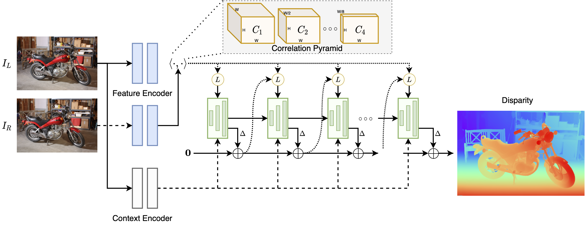
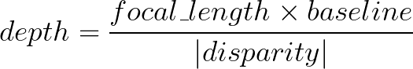

# RAFT-Stereo: Multilevel Recurrent Field Transforms for Stereo Matching
This repository contains the source code for our paper:

[RAFT-Stereo: Multilevel Recurrent Field Transforms for Stereo Matching](https://arxiv.org/pdf/2109.07547.pdf)<br/>
3DV 2021, Best Student Paper Award<br/>
Lahav Lipson, Zachary Teed and Jia Deng<br/>

```
@inproceedings{lipson2021raft,
  title={RAFT-Stereo: Multilevel Recurrent Field Transforms for Stereo Matching},
  author={Lipson, Lahav and Teed, Zachary and Deng, Jia},
  booktitle={International Conference on 3D Vision (3DV)},
  year={2021}
}
```



 

##  [ RAFT-Stereo + Point-Cloud Visualization in Google Colab](https://colab.research.google.com/drive/1G8WJCQt9y55qxQH6QV6PpPvWEbd393g2?usp=sharing)

## Requirements
The code has been tested with PyTorch 1.7 and Cuda 10.2
```Shell
conda env create -f environment.yaml
conda activate raftstereo
```
and with PyTorch 1.11 and Cuda 11.3
```Shell
conda env create -f environment_cuda11.yaml
conda activate raftstereo
```


## Required Data
To evaluate/train RAFT-stereo, you will need to download the required datasets. 
* [Sceneflow](https://lmb.informatik.uni-freiburg.de/resources/datasets/SceneFlowDatasets.en.html#:~:text=on%20Academic%20Torrents-,FlyingThings3D,-Driving) (Includes FlyingThings3D, Driving & Monkaa)
* [Middlebury](https://vision.middlebury.edu/stereo/data/)
* [ETH3D](https://www.eth3d.net/datasets#low-res-two-view-test-data)
* [KITTI](http://www.cvlibs.net/datasets/kitti/eval_scene_flow.php?benchmark=stereo)

To download the ETH3D and Middlebury test datasets for the [demos](#demos), run 
```Shell
bash download_datasets.sh
```

By default `stereo_datasets.py` will search for the datasets in these locations. You can create symbolic links to wherever the datasets were downloaded in the `datasets` folder

```Shell
├── datasets
    ├── FlyingThings3D
        ├── frames_cleanpass
        ├── frames_finalpass
        ├── disparity
    ├── Monkaa
        ├── frames_cleanpass
        ├── frames_finalpass
        ├── disparity
    ├── Driving
        ├── frames_cleanpass
        ├── frames_finalpass
        ├── disparity
    ├── KITTI
        ├── testing
        ├── training
        ├── devkit
    ├── Middlebury
        ├── MiddEval3
    ├── ETH3D
        ├── two_view_testing
```

## **(New 03/17/23)**: Robust Vision Challenge 2022

iRaftStereo_RVC ranked 2nd on the [stereo leaderboard](http://www.robustvision.net/leaderboard.php) at the Robust Vision Challenge at ECCV 2022.

To use the model, download + unzip [models.zip](https://www.dropbox.com/s/ftveifyqcomiwaq/models.zip) and run
```
python demo.py --restore_ckpt models/iraftstereo_rvc.pth --context_norm instance -l=datasets/ETH3D/two_view_testing/*/im0.png -r=datasets/ETH3D/two_view_testing/*/im1.png
```

Thank you to [Insta360](https://www.insta360.com/) and Jiang et al. for their excellent work.

See their manuscript for training details: [An Improved RaftStereo Trained with A Mixed Dataset for the Robust Vision Challenge 2022](https://arxiv.org/pdf/2210.12785.pdf)

## Demos
Pretrained models can be downloaded by running
```Shell
bash download_models.sh
```
or downloaded from [google drive](https://drive.google.com/drive/folders/1booUFYEXmsdombVuglatP0nZXb5qI89J). We recommend our [Middlebury model](https://drive.google.com/file/d/1m3KoukUmKDoMv-ySOO6vBzYfWLyj9yqd/view?usp=sharing) for in-the-wild images.

You can demo a trained model on pairs of images. To predict stereo for Middlebury, run
```Shell
python demo.py --restore_ckpt models/raftstereo-middlebury.pth --corr_implementation alt --mixed_precision -l=datasets/Middlebury/MiddEval3/testF/*/im0.png -r=datasets/Middlebury/MiddEval3/testF/*/im1.png
```
Or for ETH3D:
```Shell
python demo.py --restore_ckpt models/raftstereo-eth3d.pth -l=datasets/ETH3D/two_view_testing/*/im0.png -r=datasets/ETH3D/two_view_testing/*/im1.png
```
Our fastest model (uses the [faster implementation](#optional-faster-implementation)):
```Shell
python demo.py --restore_ckpt models/raftstereo-realtime.pth --shared_backbone --n_downsample 3 --n_gru_layers 2 --slow_fast_gru --valid_iters 7 --corr_implementation reg_cuda --mixed_precision
```

To save the disparity values as `.npy` files, run any of the demos with the `--save_numpy` flag. 

## Converting Disparity to Depth 

If the camera intrinsics and camera baseline are known, disparity predictions can be converted to depth values using



Note that the units of the focal length are _pixels_ not millimeters. (cx1-cx0) is the x-difference of principal points.

## Evaluation

To evaluate a trained model on a validation set (e.g. Middlebury), run
```Shell
python evaluate_stereo.py --restore_ckpt models/raftstereo-middlebury.pth --dataset middlebury_H
```

## Training

Our model is trained on two RTX-6000 GPUs using the following command. Training logs will be written to `runs/` which can be visualized using tensorboard.

```Shell
python train_stereo.py --batch_size 8 --train_iters 22 --valid_iters 32 --spatial_scale -0.2 0.4 --saturation_range 0 1.4 --n_downsample 2 --num_steps 200000 --mixed_precision
```
To train using significantly less memory, change `--n_downsample 2` to `--n_downsample 3`. This will slightly reduce accuracy.

To finetune the sceneflow model on the 23 scenes from the [Middlebury 2014 stereo dataset](https://vision.middlebury.edu/stereo/data/scenes2014/), download the data using

```Shell
chmod ug+x download_middlebury_2014.sh && ./download_middlebury_2014.sh
```
and run
```Shell
python train_stereo.py --train_datasets middlebury_2014 --num_steps 4000 --image_size 384 1000 --lr 0.00002 --restore_ckpt models/raftstereo-sceneflow.pth --batch_size 2 --train_iters 22 --valid_iters 32 --spatial_scale -0.2 0.4 --saturation_range 0 1.4 --n_downsample 2  --mixed_precision
```

## (Optional) Faster Implementation

We provide a faster CUDA implementation of the correlation sampler which works with mixed precision feature maps.
```Shell
cd sampler && python setup.py install && cd ..
```
Running demo.py, train_stereo.py or evaluate.py with `--corr_implementation reg_cuda` together with `--mixed_precision` will speed up the model without impacting performance.

To significantly decrease memory consumption on high resolution images, use `--corr_implementation alt`. This implementation is slower than the default, however.
